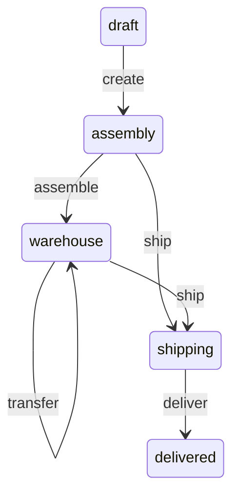

# TypeORM State Machine

[](http://commitizen.github.io/cz-cli/) [](https://codeclimate.com/github/bondiano/typeorm-fsm/maintainability) [](https://codeclimate.com/github/bondiano/typeorm-fsm/test_coverage)

`typeorm-fsm` is a strongly typed state machine designed for TypeORM entities. It allows you to define and manage state transitions in a declarative manner.

## Index

- [Usage](#usage)
  - [Events and States](#events-and-states)
  - [Entity](#entity)
  - [StateMachineEntity](#statemachineentity)
  - [Transitions](#transitions)
  - [Make transition](#make-transition)
  - [Current state](#current-state)
  - [Transition availability](#transition-availability)
  - [Subscribers](#subscribers)
  - [Lifecycle](#lifecycle)
  - [Bound lifecycle methods](#bound-lifecycle-methods)
  - [Error handling](#error-handling)
- [Installation](#installation)
- [Examples](#examples)
- [Latest Changes](#latest-changes)
- [Thanks](#thanks)

## Usage

Let's create a basic order state machine to showcase the features of the library. The diagram below illustrates the states and transitions of the state machine.



### Events and States

The library was initially designed to use `enums` for events and states. However, using string enums would provide more convenient method names. It is also possible to use `string` or `number` as event or state types, but this approach is not recommended.

```typescript
enum OrderItemState {
  draft = 'draft',
  assembly = 'assembly',
  warehouse = 'warehouse',
  shipping = 'shipping',
  delivered = 'delivered',
}
enum OrderItemEvent {
  create = 'create',
  assemble = 'assemble',
  transfer = 'transfer',
  ship = 'ship',
  deliver = 'deliver',
}
```

### Entity

To create an entity class, it must extend `StateMachineEntity` and have defined initial state and transitions. Additionally, you can combine `StateMachineEntity` with your own `BaseEntity`, which should be extended from TypeORM's base entity.

```typescript
class BaseEntity extends TypeOrmBaseEntity {
  @PrimaryGeneratedColumn()
  id: string;
}

@Entity('order')
class Order extends StateMachineEntity({
    itemsStatus: {
      id: 'orderItemsStatus',
      initial: OrderItemState.draft,
      persistContext: true,
      ctx: {
        place: 'My warehouse',
      },
      transitions: [
        t(OrderItemState.draft, OrderItemEvent.create, OrderItemState.assembly),
        t(
          OrderItemState.assembly,
          OrderItemEvent.assemble,
          OrderItemState.warehouse,
        ),
        {
          from: OrderItemState.warehouse,
          event: OrderItemEvent.transfer,
          to: OrderItemState.warehouse,
          guard(context: IOrderItemContext, place: string) {
            return context.place !== place;
          },
          onExit(context: IOrderItemContext, place: string) {
            context.place = place;
          },
        },
        t(
          [OrderItemState.assembly, OrderItemState.warehouse],
          OrderItemEvent.ship,
          OrderItemState.shipping,
        ),
        t(
          OrderItemState.shipping,
          OrderItemEvent.deliver,
          OrderItemState.delivered,
        ),
      ],
    },
  },
  BaseEntity, // It's optional
) {
  @Column({
    default: 0,
  })
  price: number;
}
```

### StateMachineEntity

Let's take a look at the `StateMachineEntity` function. It accepts an object with the following properties:

- `id` - a unique identifier for the state machine (used for debugging purposes)
- `initial` - the initial state of the state machine
- `persistContext` - if set to `true`, the state machine context will be saved to the database. Default value is `false`
- `saveAfterTransition` - if `true`, the state machine will be saved to the database after each transition. Default value is `true`
- `ctx` - initial context of the state machine
- `transitions` - an array of transitions

### Transitions

The most common way to define a transition is by using the `t` function, which requires three arguments (guard is optional).

```typescript
t(from: State, event: Event, to: State, guard?: (context: Context) => boolean)
```

However, we may need to define more complex transitions. In such cases, we can use an object with the following attributes:

- `from` - represents the state from which the transition is permitted
- `event` - denotes the event that triggers the transition
- `to` - indicates the state to which the transition leads
- `guard` - a function that verifies if the transition is permissible
- `onEnter` - a function that executes when the transition is triggered
- `onExit` - a function that executes when the transition is completed

### Make transition

To make a transition, we need to call the `transition` method of the entity or use methods with the same name as the event. State changes will persist to the database by default.

```typescript
const order = new Order();
await order.fsm.itemsStatus.create();
await order.fsm.itemsStatus.assemble();
await order.fsm.itemsStatus.transfer('Another warehouse');
await order.fsm.itemsStatus.ship();
```

We're passing the `place` argument to the `transfer` method. It will be passed to the `guard` and `onExit` functions.

### Current state

You can get the current state of the state machine using the `current` property.

```typescript
const order = new Order();
console.log(order.fsm.itemsStatus.current); // draft
```

Also you can use `is` + `state name` method to check the current state.

```typescript
const order = new Order();
console.log(order.fsm.itemsStatus.isDraft()); // true
```

Also `is(state: State)` method is available.

### Transition availability

You can check if the transition is available using the `can` + `event name` method.

```typescript
const order = new Order();

console.log(order.fsm.itemsStatus.canCreate()); // true
await order.fsm.itemsStatus.create();
console.log(order.fsm.itemsStatus.canCreate()); // false
await order.fsm.itemsStatus.assemble();
```

Arguments are passed to the `guard` function.

``` typescript
await order.fsm.itemsStatus.transfer('Another warehouse');
console.log(order.fsm.itemsStatus.canTransfer('Another warehouse')); // false
```

Also `can(event: Event, ...args)` method is available.

### Subscribers

You can subscribe to transition using the `on` method. And unsubscribe using the `off` method.

```typescript
const order = new Order();

const subscriber = (state: OrderItemState) => {
  console.log(state);
};
order.fsm.itemsStatus.on(OrderItemEvent.create, subscriber);

await order.fsm.itemsStatus.create();

order.fsm.itemsStatus.off(OrderItemEvent.create, subscriber);
```

### Lifecycle

The state machine has the following lifecycle methods in the order of execution:

```
- guard
- onEnter
- transition
- subscribers
- onExit
```

### Bound lifecycle methods

The entity instance will be bound to the lifecycle methods. You can access the entity instance using `this` keyword.

```typescript
const order = new Order();

order.fsm.itemsStatus.onEnter(function (this: Order) {
  console.log(this.id);
});
order.fsm.itemStatus.on(OrderItemEvent.create, function (this: Order) {
  console.log(this.id);
});

await order.fsm.itemsStatus.create();
```

### Error handling

Library throws `StateMachineError` if transition is not available. It can be caught using `try/catch` and checked using `isStateMachineError` function.

```typescript
import { isStateMachineError } from 'typeorm-fsm';

try {
  await order.fsm.itemsStatus.create();
} catch (error) {
  if (isStateMachineError(error)) {
    console.log(error.message);
  }
}
```

## Installation

```bash
npm install typeorm fsm-typeorm
```

## Examples

Check out the [examples](./src/__tests__/examples) directory for more examples.

## Latest Changes

Take a look at the [CHANGELOG](CHANGELOG.md) for details about recent changes to the current version.

## Thanks

This project was inspired by [aasm](https://github.com/aasm/aasm) and [typeorm-fsm](https://github.com/eram/typescript-fsm).

If you are specifically looking for a state machine, I recommend checking out [xstate](https://github.com/statelyai/xstate) first. It is a fantastic library with more features.

And thank you for reading this far. I hope you find this library useful.
