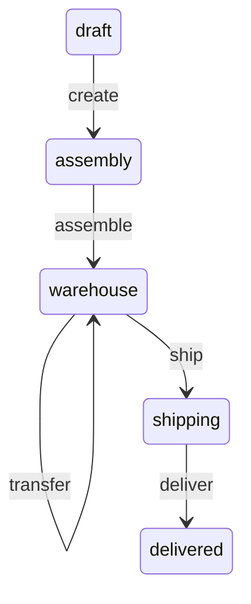

# TypeORM State Machine

`typeorm-fsm` is a strongly typed state machine designed for TypeORM entities. It allows you to define and manage state transitions in a declarative manner.

## Index

- [Usage](#usage)
  - [Events and States](#events-and-states)
  - [Entity](#entity)
  - [StateMachineEntity](#statemachineentity)
  - [Transitions](#transitions)
  - [Make transition](#make-transition)
  - [Current state](#current-state)
  - [Subscribers](#subscribers)
  - [Lifecycle](#lifecycle)
- [Installation](#installation)
- [Latest Changes](#latest-changes)
- [Thanks](#thanks)

## Usage

I'll model a simple order state machine to demonstrate the library's features. The diagram below shows the state machine's states and transitions.



### Events and States

The library was initially designed to use `enums` for events and states. However, using string enums would provide more convenient method names. It is also possible to use `string` or `number` as event or state types, but this approach is not recommended.

```typescript
enum OrderItemState {
  draft = 'draft',
  assembly = 'assembly',
  warehouse = 'warehouse',
  shipping = 'shipping',
  delivered = 'delivered',
}
enum OrderItemEvent {
  create = 'create',
  assemble = 'assemble',
  transfer = 'transfer',
  ship = 'ship',
  deliver = 'deliver',
}
```

### Entity

The entity class must extends `StateMachineEntity` with defined initial state and transitions and have `id` property.

```typescript
import { StateMachineEntity, t } from 'typeorm-fsm';

@Entity()
class Order extends StateMachineEntity({
  itemsStatus: {
    id: 'orderItemsStatus',
    initial: OrderItemState.draft,
    persistContext: true,
    ctx: {
      place: 'My warehouse',
    },
    transitions: [
      t(OrderItemState.draft, OrderItemEvent.create, OrderItemState.assembly),
      {
        from: OrderItemState.assembly,
        event: OrderItemEvent.assemble,
        to: OrderItemState.warehouse,
      },
      {
        from: OrderItemState.warehouse,
        event: OrderItemEvent.transfer,
        to: OrderItemState.warehouse,
        guard(context: { place: string }, place) {
          return context.place !== place;
        },
        onExit(context: { place: string }, place) {
          context.place = place;
        },
      },
      t(OrderItemState.warehouse, OrderItemEvent.ship, OrderItemState.shipping),
      t(
        OrderItemState.shipping,
        OrderItemEvent.deliver,
        OrderItemState.delivered,
      ),
    ],
  },
}) {
  @PrimaryGeneratedColumn()
  id: string;
}
```

### StateMachineEntity

Let's take a look at the `StateMachineEntity` function. It takes an object with the following properties:

- `id` - unique identifier of the state machine (uses for debugging purposes)
- `initial` - initial state of the state machine
- `persistContext` - if `true`, the state machine context will be saved to the database. Default: `false`
- `saveAfterTransition` - if `true`, the state machine will be saved to the database after each transition. Default: `true`
- `ctx` - initial context of the state machine
- `transitions` - array of transitions

### Transitions

The common way to define transition is to use `t` function. It takes three arguments:

```typescript
t(from: State, event: Event, to: State)
```

But sometimes we need to define more complex transitions. In this case, we can use an object with the following properties:

- `from` - state from which the transition is allowed
- `event` - event that triggers the transition
- `to` - state to which the transition leads
- `guard` - function that checks if the transition is allowed
- `onEnter` - function that is called when the transition is triggered
- `onExit` - function that is called when the transition is completed

### Make transition

To make a transition, we need to call the `transition` method of the entity or use methods with the same name as the event. State changes will persist to the database by default.

```typescript
const order = new Order();
await order.itemsStatus.create();
await order.itemsStatus.assemble();
await order.itemsStatus.transfer('Another warehouse');
await order.itemsStatus.ship();
```

We're passing the `place` argument to the `transfer` method. It will be passed to the `guard` and `onExit` functions.

### Current state

Ypu can get the current state of the state machine using the `current` property.

```typescript
const order = new Order();
console.log(order.itemsStatus.current); // draft
```

Also you can use `is` + `state name` method to check the current state.

```typescript
const order = new Order();
console.log(order.itemsStatus.isDraft()); // true
```

### Subscribers

You can subscribe to state changes using the `on` method. And unsubscribe using the `off` method.

```typescript
const order = new Order();
const subscriber = (state: OrderItemState) => {
  console.log(state);
};
order.itemsStatus.on(subscriber);
await order.itemsStatus.create();
order.itemsStatus.off(subscriber);
```

### Lifecycle

The state machine has the following lifecycle methods ordered by execution order:

```
- guard
- onEnter
- transition
- subscribers
- onExit
```

## Installation

```bash
npm install typeorm typeorm-fsm
```

## Latest Changes

Take a look at the [CHANGELOG](CHANGELOG.md) for details about recent changes to the current version.

## Thanks

This project was inspired by [aasm](https://github.com/aasm/aasm) and [typescript-fsm](https://github.com/eram/typescript-fsm).

If you are specifically looking for a state machine, I recommend checking out [xstate](https://github.com/statelyai/xstate) first. It is a fantastic library with more features.

And thank you for reading this far. I hope you find this library useful.
